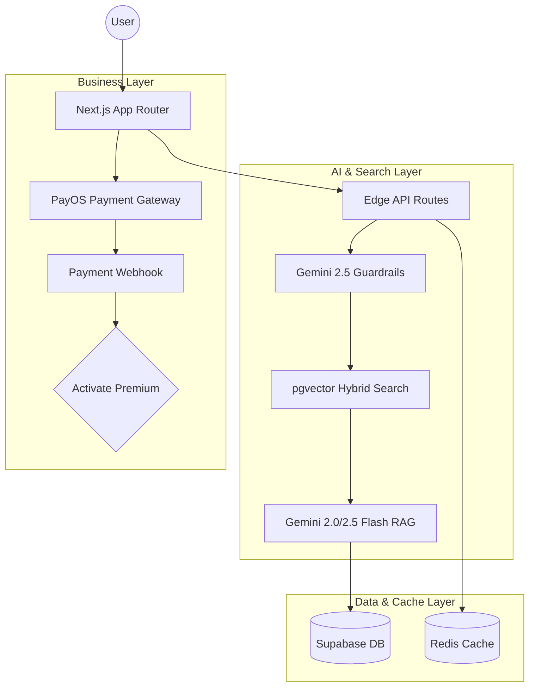

# 🍜 TasteMuse - The Ultimate AI Food Discovery Platform for Can Tho

<div align="center">
  

  [](https://nextjs.org/)
  [](https://reactjs.org/)
  [](https://tailwindcss.com/)
  [](https://supabase.com/)
  [](https://ai.google.dev/)

  **"Don't know what to eat? Let TasteMuse suggest!"**
  *TasteMuse is an intelligent, AI-driven recommendation platform designed specifically for the culinary landscape of Can Tho, Vietnam.*
</div>

---

## 🚀 Key Innovation: Advanced AI Engine

TasteMuse isn't just a chatbot; it's a sophisticated discovery engine powered by multiple AI layers:

### 1. Hybrid Ranking System
Our custom ranking algorithm combines three distinct signals to find your perfect meal:
- 🧠 **Semantic Similarity (60%)**: Context-aware understanding of your cravings.
- ⭐ **Crowd Wisdom (20%)**: Integration of real user ratings and reviews.
- 📍 **Proximity (20%)**: Real-time distance calculations for maximum convenience.
`Score = (Semantic * 0.6) + (Rating * 0.2) + (Distance * 0.2)`

### 2. User Taste Profiles (Dynamic Personalization)
The system learns your preferences in real-time. Every favorite, rating, and even chat query updates your **Taste Vector**, creating a moving average of your culinary identity.
`New_Vector = (Old_Vector * 0.7) + (Interaction_Vector * 0.3)`

### 3. Industrial-Grade Guardrails
Powered by **Gemini 2.5 Flash**, our safety system provides:
- **Input Guardrails**: Prevents unsafe content and politely handles off-topic queries.
- **Output Guardrails**: Fact-checkers verify AI responses against our database to prevent hallucinations and prompt leakage.

---

## ✨ Core Features

- 🤖 **Intelligent Chatbot**: Natural Vietnamese conversation focused on Can Tho's food and tourism.
- 📅 **Smart Meal Planning**: Generate personalized weekly or daily meal plans based on your profile.
- 🔍 **Unified Search**: Seamlessly find dishes and restaurants with vector similarity search.
- 💎 **Freemium Experience**: 
  - **Free**: 5 AI queries/day + basic discovery features.
  - **Premium**: Unlimited AI queries, Personalized recommendations, and advanced meal planning.
- 💳 **Seamless Payments**: Integrated with **PayOS** for instant subscription activation via QR code.

---

## 🏗️ Technical Architecture



### Technical Stack
- **Framework**: Next.js 16.1 (App Router), React 19, TypeScript
- **Styling**: Tailwind CSS 4, Radix UI, Framer Motion
- **Database**: Supabase (PostgreSQL), pgvector, HNSW Indexing
- **AI Models**: 
  - LLM: `gemini-2.5-flash`
  - Embeddings: `gemini-embedding-001 (3072 dimensions)`
- **Caching**: Upstash Redis
- **Infrastructure**: Vercel Hosting, Cloudinary (Media storage)

---

## 🚀 Getting Started

### 1. Prerequisites
- Node.js 18+
- pnpm (highly recommended)

### 2. Installation
```bash
git clone <your-repo-url>
cd tastemuse
pnpm install
```

### 3. Setup
1. Copy `.env.example` to `.env.local` and add your keys:
   - `NEXT_PUBLIC_SUPABASE_URL` & `NEXT_PUBLIC_SUPABASE_ANON_KEY`
   - `GEMINI_API_KEY` (Google AI Studio)
   - `PAYOS_CLIENT_ID`, `PAYOS_API_KEY`, `PAYOS_CHECKSUM_KEY` (PayOS)
   - `UPSTASH_REDIS_REST_URL` & `UPSTASH_REDIS_REST_TOKEN` (Redis)

2. **Initialize Data**:
```bash
# Generate vector embeddings for restaurants and dishes
pnpm run embeddings
```

### 4. Development
```bash
pnpm run dev
```

---

## 📁 System Modules

- `app/api/chat/`: The high-performance RAG endpoint with 8 processing steps.
- `lib/hybrid-ranking.ts`: The core scoring engine.
- `lib/user-taste.ts`: Vector-based personalization logic.
- `lib/guardrails.ts`: Safety and grounding verification.
- `lib/document-sync.ts`: Automated RAG pipeline for new data.

---

## 🤝 Developing with Quality
The project includes a robust testing suite for the entire AI pipeline:
```bash
# Verify the health of the RAG system
pnpm run test:rag
```

---
<div align="center">
  Developed by <b>Dinh Minh Tien</b><br/>
  Made with ❤️ for the Can Tho Food Community
</div>
