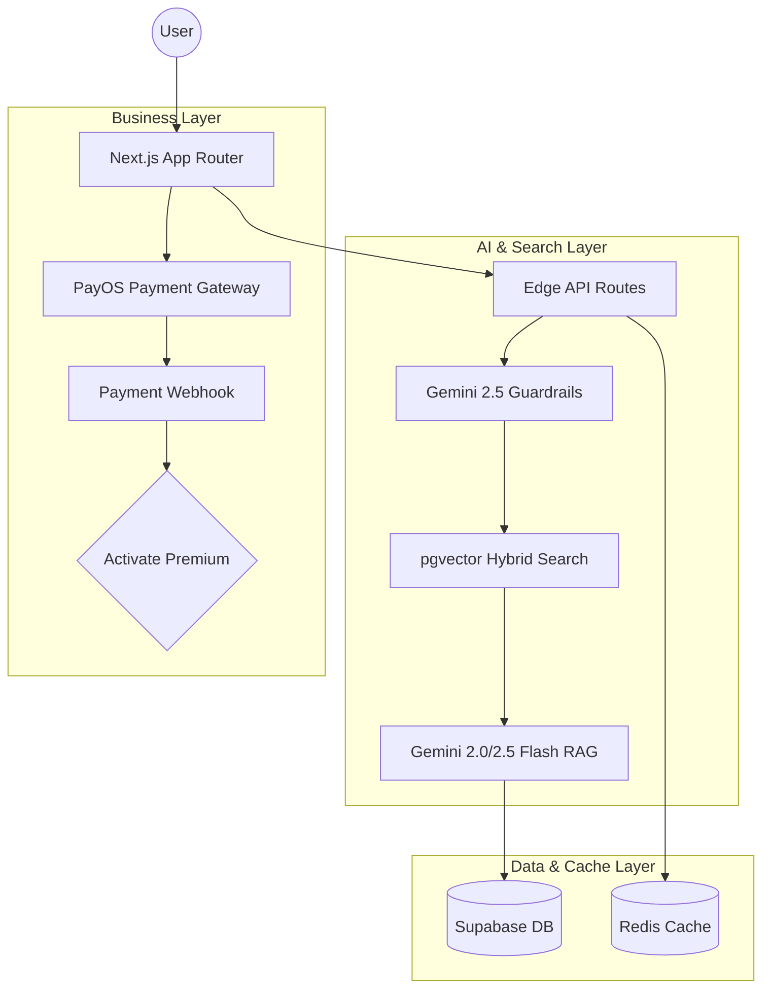

# TasteMuse - AI Food Discovery Platform for Can Tho

<div align="center">
  

  TasteMuse is an intelligent, automated recommendation platform designed for the culinary landscape of Can Tho, Vietnam.
</div>

---

## Technical Innovation: Advanced AI Engine

TasteMuse functions as a sophisticated discovery engine utilizing multiple AI layers.

### 1. Hybrid Ranking System
The custom ranking algorithm combines three distinct signals to determine meal recommendations:
- **Semantic Similarity (60%)**: Context-aware understanding of user queries.
- **Crowd Wisdom (20%)**: Integration of historical user ratings and reviews.
- **Proximity (20%)**: Real-time distance calculations for geographic relevance.
`Score = (Semantic * 0.6) + (Rating * 0.2) + (Distance * 0.2)`

### 2. User Taste Profiles (Dynamic Personalization)
The system learns preferences dynamically in real-time. Interactions such as favorites, ratings, and chat queries update the user's Taste Vector, maintaining a moving average of culinary preferences.
`New_Vector = (Old_Vector * 0.7) + (Interaction_Vector * 0.3)`

### 3. Industrial-Grade Guardrails
Powered by Gemini 2.5 Flash, the internal system architecture utilizes:
- **Input Guardrails**: Prevents processing of unsafe content and handles off-topic queries appropriately.
- **Output Guardrails**: Fact-checks AI responses against the proprietary database to prevent hallucinations and avoid prompt injection leaks.

---

## Core System Capabilities

- **Intelligent Chatbot**: Context-aware conversational agent focused exclusively on Can Tho's food and tourism.
- **Smart Meal Planning**: Automatic generation of weekly or daily meal plans based on individual user profiles.
- **Unified Search**: Centralized search mechanism for dishes and restaurants leveraging vector similarity.
- **Tiered Access Model**:
  - **Standard**: Five processing queries per day with access to basic discovery features.
  - **Premium**: Unlimited processing queries, advanced personalization, and comprehensive meal planning.
- **Integrated Payments**: Real-time processing via PayOS for instant subscription handling.

---

## Architecture Overview



### Technical Stack
- **Framework**: Next.js 16.1 (App Router), React 19, TypeScript
- **Styling**: Tailwind CSS 4, Radix UI, Framer Motion
- **Database**: Supabase (PostgreSQL), pgvector, HNSW Indexing
- **AI Models**: 
  - LLM: gemini-2.5-flash
  - Embeddings: gemini-embedding-001
- **Caching**: Upstash Redis
- **Infrastructure**: Vercel Hosting, Cloudinary

---

## Setup and Development Configuration

### 1. Prerequisites
- Node.js 18+
- pnpm

### 2. Initial Setup
```bash
git clone <your-repo-url>
cd tastemuse
pnpm install
```

### 3. Environment Variables
Copy `.env.example` to `.env.local` and define the required parameters:
- `NEXT_PUBLIC_SUPABASE_URL` & `NEXT_PUBLIC_SUPABASE_ANON_KEY`
- `GEMINI_API_KEY`
- `PAYOS_CLIENT_ID`, `PAYOS_API_KEY`, `PAYOS_CHECKSUM_KEY`
- `UPSTASH_REDIS_REST_URL` & `UPSTASH_REDIS_REST_TOKEN`

### 4. Database Initialization
```bash
# Generate corresponding vector embeddings for the preliminary dataset
pnpm run embeddings
```

### 5. Local Server
```bash
pnpm run dev
```

---

## Core System Modules

- `app/api/chat/`: High-performance RAG endpoint executing 8 processing steps.
- `lib/domain/hybrid-ranking.ts`: Core ranking formula implementation.
- `lib/domain/user-taste.ts`: Vector-based calculation handler for user profiles.
- `lib/ai/guardrails.ts`: Systemic safety constraint policies.
- `lib/db/document-sync.ts`: Automated pipeline handler for syncing new database entries into vector forms.

---

## Testing Verification
Execute the automated test suite to ensure RAG integrity:
```bash
pnpm run test:rag
```

---
<div align="center">
  Developed by <b>Dinh Minh Tien</b><br/>
</div>